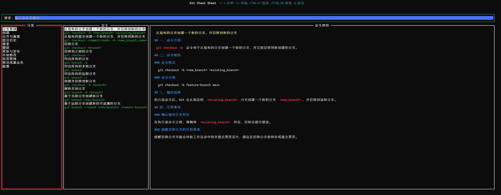
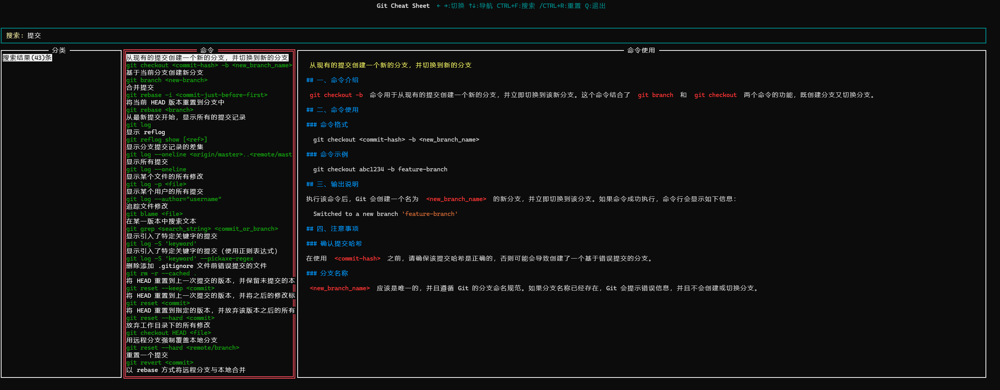

# Git Cheat Sheet TUI

## 项目简介

Git Cheat Sheet TUI 是一个终端用户界面，用于快速查看和使用 Git 命令的速查表。项目使用 Go 语言开发，基于 tview 构建终端界面。

## 功能特性

- 分类浏览 Git 命令
- 快速搜索命令
- 命令使用说明查看
- Markdown 格式支持
- 终端颜色支持
- 快捷键操作

程序基于`windows11`和`go version go1.23.2 windows/amd64`开发,其他环境因缺乏设备测试,可能会出现兼容性问题。请使用`window terminal`以获得最佳体验。

## 项目截图

主界面



搜索界面



## 使用说明

### 快捷键

- `←`/`→`：切换焦点
- `↑`/`↓`：导航列表
- `Ctrl+F`：搜索命令
- `Ctrl+R`：重置搜索
- `Q`：退出程序

### 命令行参数

程序支持以下命令行参数：

- `-s` 或 `--search`：启动时直接搜索指定命令
- `-l` 或 `--showlog`：显示日志面板

### 使用示例

1. 启动程序并显示日志面板：

   ```bash
   ./git-cheat-sheet-tui -l
   ```

2. 启动时直接搜索"commit"命令：

   ```bash
   ./git-cheat-sheet-tui -s commit
   ```

3. 启动时直接搜索"branch"命令并显示日志面板：
   ```bash
   ./git-cheat-sheet-tui -s branch -l
   ```

`git-cheat-sheet-tui`仅作示例说明,实际根据程序名称进行修改,发布时为简化使用程序名默认为`gitsheet`

## 安装指南

### 前置要求

- Go 1.21 或更高版本
- Git
- python3(可选,用于生成命令元数据,生成文档等)

### 安装步骤

1. 克隆本仓库：

   ```bash
   git clone https://github.com/ciclebyte/git-cheat-sheet-tui.git
   cd git-cheat-sheet-tui
   ```

2. 安装依赖：

   ```bash
   go mod tidy
   ```

3. 编译项目：

   ```bash
   go build
   ```

4. 运行程序：
   ```bash
   ./git-cheat-sheet-tui
   ```

## 开发指南

### 依赖管理

项目使用 Go Modules 进行依赖管理，所有依赖项在 `go.mod` 文件中定义。

### 主要依赖

- `github.com/rivo/tview`：终端用户界面框架
- `github.com/gdamore/tcell/v2`：终端界面渲染
- `github.com/mattn/go-sqlite3`：SQLite 数据库驱动
- `github.com/charmbracelet/glamour`：Markdown 渲染
- `github.com/spf13/cobra`：命令行参数处理

### git 文档说明

文档存放在 docs 目录下,文档采用 markdown 格式编写。

文档目录结构如下：

```plaintext
docs
├── commands  分类
│ ├── branch.md 命令
│ ├── branch.meta 命令元数据 存放标题,描述,和命令等数据。由python脚本自动生成。
```

命令参考`https://github.com/arslanbilal/git-cheat-sheet`提供。

git 使用文档由`DeepSeek-V3`模型自动生成。不对准确性负责,请注意甄别。

### 脚本说明

脚本目录结构如下：

```plaintext
scripts
├── gen_meta.py 生成命令元数据
├── gen_db.py 生成数据库及sql,由sqlite3驱动
├── gen_content.py 调用ai模型生成文档
├── template.md ai模型生成文档的模板
```

python 依赖

```bash
pip install openai
pip install pyyaml
pip install sqlalchemy
```

打包前依赖:resources\commands.sql,请确保文件存在。可以通过`gen_db.py`生成,请删除 commands.db 以减小打包体积。

### 构建

1. 构建可执行文件：
   ```bash
   go build -o git-cheat-sheet-tui
   ```

## 贡献指南

欢迎提交 Issue 和 Pull Request。请确保代码符合 Go 语言规范，并通过所有测试。

## 许可证

本项目采用 MIT 许可证，详情请查看 LICENSE 文件。
